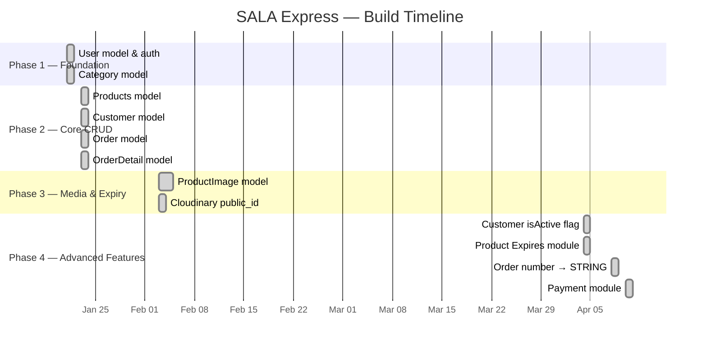
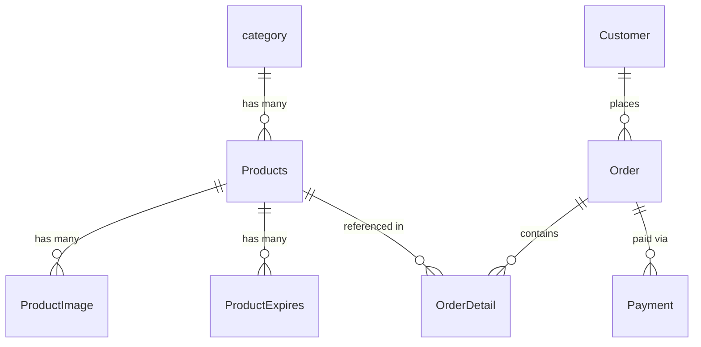

# 📊 Project Process Report
## SALA Express — Backend API System
**Generated:** 2026-05-02 · **Status:** 🟡 In Progress / Pre-Production

---

## 🗺 Development Timeline

> Based on Sequelize migration timestamps — this is the chronological build order of the system.



---

## ✅ Module Completion Status

| Module | Models | Routes | Controller | Status |
|---|:---:|:---:|:---:|:---:|
| 🔐 Authentication (User) | ✅ | ✅ | ✅ (inline) | 🟢 Done |
| 🏷️ Categories | ✅ | ✅ | ✅ | 🟢 Done |
| 📦 Products | ✅ | ✅ | ✅ | 🟢 Done |
| 🖼️ Product Images | ✅ | ✅ | ✅ (inline) | 🟢 Done |
| ⏰ Product Expiry | ✅ | ✅ | ✅ | 🟢 Done |
| 👤 Customers | ✅ | ✅ | ✅ | 🟢 Done |
| 🛍️ Orders | ✅ | ✅ | ✅ | 🟡 Partial (hardcoded customerId) |
| 💳 Payments (ABA Payway) | ✅ | ✅ | ✅ | 🟡 Sandbox only |
| 📄 Invoice Generator | — | ✅ | ✅ (inline) | 🟢 Done |
| 🤖 Telegram Notifications | — | — | ✅ (in ExpireCtrl) | 🟢 Done |
| 🛡️ Auth Middleware (JWT) | — | — | ✅ (defined) | 🔴 Not applied |
| 🔒 Role-Based Access | — | ❌ | ❌ | ❌ Not started |
| 🧪 Tests | — | ❌ | ❌ | ❌ Not started |
| 📋 Input Validation | — | ❌ | ❌ | ❌ Not started |

---

## 📡 API Coverage

**Total endpoints: 28**

```
┌────────────────────────────────────────┬────────┐
│ Module                                 │ Count  │
├────────────────────────────────────────┼────────┤
│ Auth                                   │  3     │
│ Products (CRUD + images)               │  8     │
│ Categories                             │  4     │
│ Customers                              │  4     │
│ Orders + Invoice                       │  2     │
│ Product Expiry                         │  7     │
│ Payments                               │  2     │
│ Health                                 │  1     │
├────────────────────────────────────────┼────────┤
│ TOTAL                                  │  28    │
└────────────────────────────────────────┴────────┘
```

---

## 🗃 Database Migration Progress

| # | Migration File | Status |
|---|---|:---:|
| 1 | `20260121111659-create-user` | ✅ |
| 2 | `20260121114320-create-category` | ✅ |
| 3 | `20260123161643-create-products` | ✅ |
| 4 | `20260123162045-create-customer` | ✅ |
| 5 | `20260123162644-create-order` | ✅ |
| 6 | `20260123163144-create-order-detail` | ✅ |
| 7 | `20260203150351-create-product-image` | ✅ |
| 8 | `20260203150356-add-public-id-to-product-image` | ✅ |
| 9 | `20260404002800-remove-password-add-isActive-to-customer` | ✅ |
| 10 | `20260404061339-create-product-expires` | ✅ |
| 11 | `20260408145241-change-orderNumber-to-string` | ✅ |
| 12 | `20260410014705-create-payment` | ✅ |

**12 / 12 migrations complete ✅**

---

## 🔗 Data Model Relationships



---

## 🚦 Current System Health

### ✅ What is Working Well

- **Full CRUD** implemented for all 8 resource types
- **Pagination + search** on Products and ProductExpiry (page, limit, totalPages, hasNextPage)
- **Cloudinary** image upload and deletion integrated correctly
- **ABA Payway KHQR** payment flow with proper HMAC-SHA512 signing
- **Telegram notifications** — both manual endpoint and daily automated cron (07:00 AM ICT)
- **DOCX invoice generation** via `docxtemplater` with order template
- **Request logging** — IP, browser, OS, device on every request
- **DB associations** properly defined with named `as` aliases
- **Consistent JSON response** format: `{ success, message, data, pagination }`
- **CORS** restricted to known frontend origins

---

### 🔴 Critical Bugs / Blockers

| Priority | Issue | File | Fix |
|:---:|---|---|---|
| 🔴 P1 | `authMiddleware` imported but **never applied** — all routes are public | `App.js` | Add `app.use(authMiddleware)` before private routes |
| 🔴 P1 | JWT `decoded` is discarded — `req.user` never set | `authMiddleware.js:16` | Add `req.user = decoded;` |
| 🔴 P1 | Customer password stored **in plaintext** | `customerController.js:23` | Hash with `bcrypt.hash(password, 10)` |
| 🔴 P1 | `customerId: 5` **hardcoded** in order creation | `orderController.js:66` | Resolve from `req.user` or request body |
| 🟠 P2 | `GET /auth/users` is **public** and unguarded | `auth.js:33` | Apply `authMiddleware` to this route |
| 🟡 P3 | `checkTransaction` catch block has no `res.json()` | `paymentController.js:206` | Add error response in catch |
| 🟡 P3 | Typo: folder named `templete` instead of `template` | `src/routes/templete/` | Rename folder |

---

### 🟡 Technical Debt

| Area | Issue |
|---|---|
| **No input validation library** | Only manual `if (!field)` checks — inconsistent and fragile |
| **Duplicate pagination logic** | `parsePagination` only in expiry controller; `productController` duplicates it inline |
| **No error handling middleware** | No global Express error handler (`app.use((err, req, res, next) => {...})`) |
| **No security headers** | `helmet` package not used |
| **No rate limiting** | Brute-force attacks possible on `/auth/login` |
| **Empty seeders folder** | No seed data for development/testing |
| **No `.gitignore` for `.env`** | Real credentials risk being committed to git |
| **Debug log left in upload** | `console.log(file)` in `fileUpload.js:20` |

---

## 🗺 Roadmap — Next Steps

### 🔴 Phase 5 — Security Hardening (Do First!)
- [ ] Apply `authMiddleware` to all private routes in `App.js`
- [ ] Fix `req.user` assignment in `authMiddleware.js`
- [ ] Hash customer passwords with bcrypt
- [ ] Fix hardcoded `customerId: 5` in orders
- [ ] Add `helmet` → `npm install helmet`
- [ ] Add `express-rate-limit` → `npm install express-rate-limit`
- [ ] Add `.env` to `.gitignore` **immediately**

### 🟠 Phase 6 — Validation & Error Handling
- [ ] Install Joi: `npm install joi`
- [ ] Create `src/validators/` — one schema file per module
- [ ] Add global error handler middleware in `App.js`
- [ ] Add default `PORT` fallback: `process.env.PORT || 3000`

### 🟡 Phase 7 — Architecture Cleanup
- [ ] Extract `parsePagination` + `paginatedResponse` to `src/utils/pagination.js`
- [ ] Move auth inline logic to `src/routes/Controller/authController.js`
- [ ] Rename `templete/` → `template/`
- [ ] Fix `generateReport.js` path (use `__dirname` correctly)
- [ ] Remove `console.log(file)` from upload handler
- [ ] Add `ORDER BY` to Customer and Category queries

### 🟢 Phase 8 — Production Readiness
- [ ] Write integration tests (Jest + Supertest)
- [ ] Add structured logging (Winston or Pino)
- [ ] Add soft-delete with `paranoid: true` on key models
- [ ] Add Swagger/OpenAPI docs (`swagger-jsdoc` + `swagger-ui-express`)
- [ ] Configure PM2 for production process management
- [ ] Switch ABA Payway from Sandbox → Production
- [ ] Add DB connection pool config in `config.js`
- [ ] Implement JWT refresh token mechanism

---

## 📊 Project Metrics Summary

| Metric | Value |
|---|---|
| **Project Start** | January 21, 2026 |
| **Last Migration** | April 10, 2026 |
| **Total Models** | 9 |
| **Total Migrations** | 12 ✅ |
| **Total Controllers** | 6 + 2 inline |
| **Total Route Files** | 9 |
| **Total API Endpoints** | 28 |
| **Total Seeders** | 0 |
| **Lines of Code (approx)** | ~1,300 |
| **Test Coverage** | 0% ❌ |
| **Security Hardened** | ❌ Not yet |

---

## 🏆 Overall Project Level

```
Beginner ─────────────────● Intermediate ──────────────── Advanced
                                  ▲
                           You are here
```

> **🟡 Intermediate** — The system has real-world integrations (ABA Payway, Cloudinary, Telegram, DOCX generation, cron jobs) and a clean modular structure. The main gaps are **security** (unprotected routes, plaintext passwords) and **validation** — these must be resolved before production deployment.

---

*Report generated from full codebase analysis on 2026-05-02*
